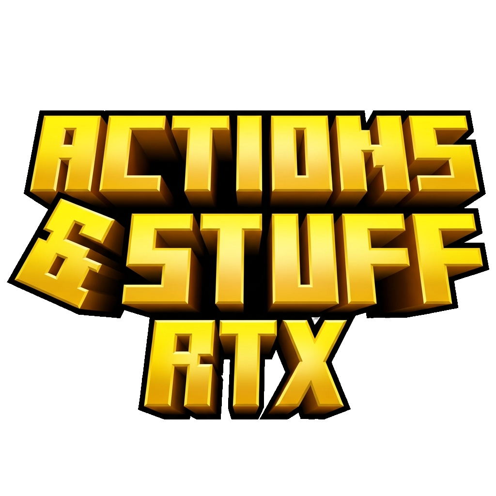

---

# 🎮 A&S Minecraft RTX Community Patcher V2

---

## 📑 Table of Contents

1. [⚠️ Important Notice](#⚠️-important-notice)  
2. [💡 What Is *A&S RTX Patcher*?](#💡-what-is-ans-rtx-patcher)  
3. [🧩 Project Progress](#🧩-project-progress)  
4. [📁 Repository Overview](#📁-repository-overview)  
5. [⚙️ Requirements](#⚙️-requirements)  
6. [🚀 How to Use](#🚀-how-to-use)  
   - [🧱 Standard Usage](#🧱-standard-usage)  
   - [�🧰 Building from Source](#🧰-building-from-source)  
7. [💾 Downloads](#💾-downloads)  
8. [📚 Additional Resources](#📚-additional-resources)  
9. [🙌 Contributors](#🙌-contributors)  
10. [👤 Creator & Support](#👤-creator--support)  
11. [🧠 Tools Used](#🧠-tools-used)  
12. [⚖️ Disclaimer](#⚖️-disclaimer)

---

## ⚠️ Important Notice

This is a **community-driven RTX enhancement project** for *Actions & Stuff* by **Oreville Studios**.  
The patcher **applies fixes and RTX enhancements to your own copy** of A&S — it does **not** distribute any part of the original resource pack.  

We kindly ask all users **not to share their patched copies** of A&S Enhanced for RTX publicly.  

You can always find the latest stable builds on the [Releases Page](https://github.com/Felix-Chaos/A-S-Minecraft-RTX-Community-Patcher/releases/latest).

---

## 💡 What Is *A&S RTX Patcher*?

**A&S Minecraft RTX Community Patcher V2** is a **community-built patching tool** that converts the original *Actions & Stuff* Minecraft Marketplace pack into an **RTX-compatible version** for Windows Bedrock Edition.

### ✨ New in V2
* 🚀 **Faster Patching**: Optimized patching engine with background processing.
* 🎨 **Refreshed UI**: Modern, clean interface with Dark Mode.
* 🛠️ **Smart Detection**: Multi-factor scoring system to find your pack.
* 📦 **Unified Patcher**: Supports both Marketplace and Zip/McPack sources.
* 🔧 **Advanced Mode**: Manual inputs, version override, and direct folder access.
* 🧹 **Auto-Cleanup**: Automatically keeps your disk clean after patching.

It works by:
* Combining your **official Marketplace copy** (or local `.zip`/`.mcpack`) with the **community RTX modification**
* Generating a **new patched version** that supports full **BetterRTX lighting**, reflections, and PBR materials

This ensures RTX visuals are properly integrated **without redistributing** any copyrighted pack data.

---

## 📁 Repository Overview

| Name                      | Description                                                        | Link                                                    | Status                |
| ------------------------- | ------------------------------------------------------------------ | ------------------------------------------------------- | --------------------- |
| **A&S RTX Patcher V2**    | Main patcher executable (Marketplace & Zip support)                | [Source](./src)                                         | ✅ Active             |
| **Tools**                 | Utilities for creating custom patches or self-building the patcher | [Tools](./tools)                                        | 🧰 Included           |

---

## ⚙️ Requirements

* [**BetterRTX**](https://bedrock.graphics/) (must be installed)  
* A valid copy of [**Actions & Stuff**](https://www.minecraft.net/en-us/marketplace/pdp/oreville-studios/actions--stuff-1.6/61c7a786-d7ad-49e0-a710-817121cd9795)  
  *(Marketplace, .zip, or .mcpack format supported)*

---

## 🚀 How to Use

### 🧱 Standard Usage
1. Download **A&S RTX Patcher V2** from the [Releases Page](https://github.com/Felix-Chaos/A-S-Minecraft-RTX-Community-Patcher/releases/latest).
2. Run the `.exe` and choose:
   * **Marketplace Mode**: Auto-detects your installed pack.
   * **ZIP/MCPACK Mode**: Manually select your pack file.
3. Click **Start** to begin patching.
4. **Configuration Required:**
   * **Disable "Mob Dithering"** in Video Settings. This fixes visual glitches.
   * **Load Order**: Ensure your packs are sorted Top to Bottom:
     1. **A&S RTX** (Use this!)
     2. **RTX Pack** (Kelly's / Vanilla RTX / etc.)
     3. *(BetterRTX - Optional)*
     4. *Other Resource Packs*
     5. **Actions & Stuff** (Original)

### 🛠️ Advanced Mode
Toggle **Advanced Mode** (bottom switch) to unlock:
* **Manual Inputs**: Override source or patch files.
* **Version Selection**: Force a specific patch version.
* **Open Folder**: Quickly access the generated `.mcpack` after patching.

---

### �🧰 Building from Source

Want to make your own patcher?  
Browse this repository, every tool and script includes a short README with setup steps and required dependencies.

---

## 💾 Downloads

### 🚀 Get the Patcher

[-orange?style=for-the-badge&logo=github)](https://github.com/Felix-Chaos/A-S-Minecraft-RTX-Community-Patcher/releases/tag/V2.0.3b)

---

<strong>📂 Older Versions & History</strong>

 

<strong>↳ Minecraft GDK (Modern - V1.21.120+) </strong>

> *For modern Minecraft installations (Xbox App / GDK)*
* [Beta A&S RTX Patcher v2.0.3b (for A&S 1.9)](https://github.com/Felix-Chaos/A-S-Minecraft-RTX-Community-Patcher/releases/tag/V2.0.3b)
* [Beta A&S RTX Patcher v2.0.2b (for A&S 1.9)](https://github.com/Felix-Chaos/A-S-Minecraft-RTX-Community-Patcher/releases/tag/V2.0.2b)
* [Beta A&S RTX Patcher v2.0.1b (for A&S 1.9)](https://github.com/Felix-Chaos/A-S-Minecraft-RTX-Community-Patcher/releases/tag/V2.0.1b)
* [A&S RTX Patcher v1.0.4 (for A&S 1.8)](https://github.com/Felix-Chaos/A-S-Minecraft-RTX-Community-Patcher/releases/tag/1.0.4)
* [A&S RTX Patcher v1.0.3 (for A&S 1.7)](https://github.com/Felix-Chaos/A-S-Minecraft-RTX-Community-Patcher/releases/tag/1.0.3)

 

<strong>↳ Minecraft UWP (Legacy - Pre-1.21.120) </strong>

> *For older/legacy Minecraft installations*

* [A&S RTX Patcher v1.0.2 (for A&S 1.7)](https://github.com/Felix-Chaos/A-S-Minecraft-RTX-Community-Patcher/releases/tag/1.0.2)
* [A&S RTX Patcher v1.0.1 (for A&S 1.6)](https://github.com/Felix-Chaos/A-S-Minecraft-RTX-Community-Patcher/releases/tag/U_N_v1.0.1)  
* [A&S RTX Patcher v0.1.13 (for A&S 1.4)](https://github.com/Felix-Chaos/A-S-Minecraft-RTX-Community-Patcher/releases/tag/0.1.13)  

 

### ⚗️ Experimental Builds

* [U_0.1.1 Universal Patcher (for 1.6 from 1.4 patch)](https://github.com/Felix-Chaos/A-S-Minecraft-RTX-Community-Patcher/releases/tag/U_0.1.1)

### 🕹️ Legacy Versions

* v1.07 (A&S 1.3) - *Outdated*  
* v1.08 (A&S 1.3.1) - *Outdated*

---

## 📚 Additional Resources

* [📖 FAQ](https://discord.com/channels/691547840463241267/1360688874388455504/1376325634246049792)  
* [🧾 Changelog v1.13](https://discord.com/channels/691547840463241267/1360688874388455504/1384665181715566622)  
* [💬 BetterRTX Discord](https://discord.gg/5kK4EMRbd3)  
* [🎮 ChaosDev Projects](https://discord.gg/YrMMmN2kc7)
* [📢 Project Thread](https://discord.com/channels/691547840463241267/1360688874388455504)  
* [📜 Original Post](https://discord.com/channels/691547840463241267/1360688874388455504/1360688874388455504)  

---

## 🙌 Contributors

This project wouldn’t exist without the help of our amazing contributors. Huge thanks to everyone who has contributed code, patches, bug fixes, or testing support:

| Name / Handle         | Role / Contribution                                      | Contact / Profile                                                    |
| --------------------- | -------------------------------------------------------- | -------------------------------------------------------------------- |
| **@J4vi3r6003**       | Patch development, subpack improvements, bug fixes       | Discord: `error90099900#0000`                                        |
| **@Felix-Chaos**      | Project maintenance, patcher updates, release management | [GitHub](https://github.com/Felix-Chaos) / Discord: `felixchaos`     |
| **Demente Parker**    | Original creator, source files provider                  | Discord: `demente_parker` / [Ko-fi](https://ko-fi.com/dementeparker) |
| **Community Testers** | Bug reporting, patch testing, feedback                   | Various Discord contributors                                         |

> Contributions are welcome! If you’d like to help with patch development, testing, or documentation, feel free to open a PR or join the [BetterRTX Discord](https://discord.gg/5kK4EMRbd3) or [ChaosDev Projects](https://discord.gg/YrMMmN2kc7).

---

## 👤 Creator & Support

This project is a **community fork** maintained for public RTX development.  
The **original creator**, who made the source files available, is:

**Demente Parker**

* Discord ID: `498173069517651998`  
* Discord: `demente_parker`  
* 💙 Support him directly on Ko-fi: [ko-fi.com/dementeparker](https://ko-fi.com/dementeparker)

> Donations are optional and go **directly to the creator**.  
> This repository itself is **non-profit** and serves only to support community collaboration.

---

## 🧠 Tools Used

* [**xdelta3**](https://github.com/jmacd/xdelta) - Binary patch creation and application  
* [**Blockbench**](https://www.blockbench.net/) - Model editing & RTX material setup

---

## ⚖️ Disclaimer

This patcher is provided by the community for **educational and personal use only**.  
It is **not affiliated with or endorsed** by Oreville Studios or Mojang/Microsoft.  
All original assets remain property of their respective owners.

> 🤖 **Note**: The V2 overhaul of this project, including the code refactoring, UI improvements, and automated build system, was developed with the assistance of **Google DeepMind's AI models** to accelerate development for the community.

---

⭐ **Thank you for being part of the A&S RTX community!**  
Your support, testing, and feedback keep this project alive, together we make RTX shine brighter. 💎
