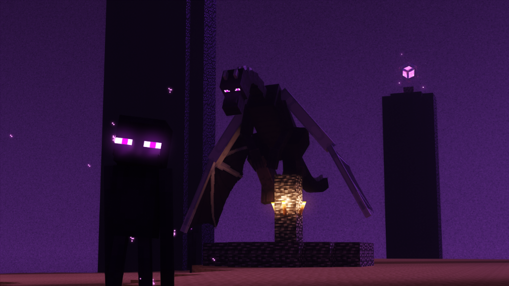
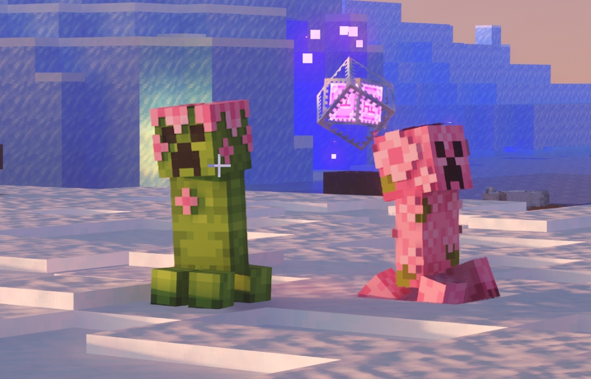
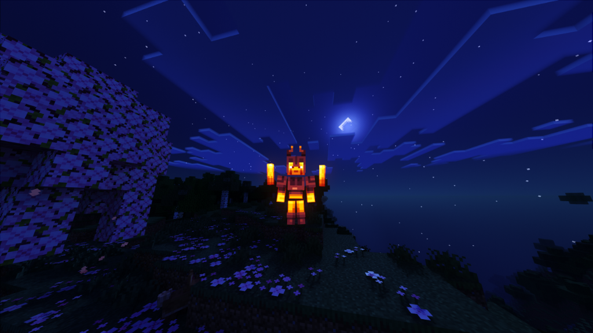

<table>
<tr>
<td width="180" align="center">

</td>
<td>

## A&S Minecraft RTX Community Patcher

*Community-built patching tool for RTX-compatible Actions & Stuff on Bedrock Edition*

[](https://github.com/Felix-Chaos/Actions-and-Stuff-RTX-Patcher/releases)
[](https://github.com/Felix-Chaos/Actions-and-Stuff-RTX-Patcher/stargazers)
[](https://github.com/Felix-Chaos/Actions-and-Stuff-RTX-Patcher/issues)
[](https://github.com/Felix-Chaos/Actions-and-Stuff-RTX-Patcher/actions/workflows/pylint.yml)
[](https://discord.gg/YrMMmN2kc7)
[](https://discord.com/channels/691547840463241267/1360688874388455504/1376325634246049792)
[](https://discord.gg/5kK4EMRbd3)
[](https://discord.com/channels/691547840463241267/1360688874388455504)

[](https://github.com/Felix-Chaos/Actions-and-Stuff-RTX-Patcher/releases/latest)

</td>
</tr>
</table>

---

- 🔧 Converts the **Actions & Stuff** Marketplace pack into an **RTX-compatible version**
- 💡 Adds full **BetterRTX lighting**, reflections, and **PBR materials**
- 📦 Supports **Marketplace auto-detect**, `.zip`, and `.mcpack` input formats
- 🔒 Does **not redistribute** any original pack assets — your copy, your patch

---

> [!WARNING]
> This is a **community-driven RTX enhancement project** for _Actions & Stuff_ by **Oreville Studios**.
> The patcher **applies fixes and RTX enhancements to your own copy** of A&S, it does **not** distribute any part of the original resource pack.
>
> We kindly ask all users **not to share their patched copies** of A&S Enhanced for RTX publicly.

---

## 📁 Project Ecosystem

| | Repository | Description | Link |
| :---: | :--- | :--- | :---: |
| ⚡ | **A&S RTX Patcher** | Main patcher — Marketplace & Zip support, GUI, automated patching | [This Repo](https://github.com/Felix-Chaos/Actions-and-Stuff-RTX-Patcher) |
| 📦 | **Archive** | All binary patch files (`.xdelta` / `.vcdiff`) and the legacy V1 patcher source | [Repo →](https://github.com/Felix-Chaos/Actions-and-Stuff-RTX-Patcher-Archive) |
| 🧰 | **External Tools** | Brarchive extractor and other tools for the patcher | [Repo →](https://github.com/Felix-Chaos/Actions-and-Stuff-RTX-Patcher-External_Tools) |

---

## 🚀 Getting Started

<table>
<tr>
<td>

| | Requirement | Details |
| :---: | :--- | :--- |
| 🎮 | [**BetterRTX**](https://bedrock.graphics/) | Must be installed |
| 📦 | [**Actions & Stuff**](https://www.minecraft.net/en-us/marketplace/pdp/oreville-studios/actions--stuff-1.6/61c7a786-d7ad-49e0-a710-817121cd9795) | Marketplace, `.zip`, or `.mcpack` |

</td>
<td width="260" align="center">

[](https://github.com/Felix-Chaos/Actions-and-Stuff-RTX-Patcher/releases/latest)

[](https://github.com/Felix-Chaos/Actions-and-Stuff-RTX-Patcher/releases/tag/V2.0.4b)

[](./docs/TUTORIAL.md)

</td>
</tr>
</table>


---

## 🔍 How It Works

The patcher uses **binary diffing** to transform your own copy of Actions & Stuff into an RTX-compatible version — no original assets are ever distributed.

```
Your A&S Copy ──→ xdelta3 + .vcdiff patch ──→ A&S Enhanced for RTX (.mcpack)
```

1. **Detect** — Locates your installed A&S pack (Marketplace auto-detect or manual selection)
2. **Extract** — Unpacks the source files from `.brarchive`, `.zip`, or `.mcpack`
3. **Patch** — Applies binary diffs (`.vcdiff`) via [xdelta3](https://github.com/jmacd/xdelta) to add RTX materials, PBR textures, and lighting fixes
4. **Package** — Bundles everything into a ready-to-install `.mcpack` with an updated manifest

> [!TIP]
> The patcher can also auto-adjust your Minecraft video settings for optimal RTX performance — no manual config needed.

---

## 🎬 Showcase

### Videos
*In-game video showcases of A&S Enhanced for RTX, courtesy of **Saruky** (Discord: `sarupatty_`).*

<video src="https://github.com/Felix-Chaos/Actions-and-Stuff-RTX-Patcher/raw/main/docs/showcase/Minecraft%202026.05.04%20-%2018.40.35.01.mp4" controls preload="none" width="100%"></video>

<video src="https://github.com/Felix-Chaos/Actions-and-Stuff-RTX-Patcher/raw/main/docs/showcase/Minecraft%202026.05.04%20-%2018.43.04.02.mp4" controls preload="none" width="100%"></video>

<video src="https://github.com/Felix-Chaos/Actions-and-Stuff-RTX-Patcher/raw/main/docs/showcase/Minecraft%202026.05.05%20-%2020.45.26.01.mp4" controls preload="none" width="100%"></video>

### Screenshots
*In-game screenshots of the patch in action, courtesy of patch creator **J4vi3r6003** (Discord: `error90099900`).*

<p align="center">
  
  
  
</p>

---

## 🛠️ Tech Stack

| Technology | Purpose |
| :--- | :--- |
| **Python** | Core patching logic, GUI, and build system |
| **CustomTkinter** | Modern dark-themed desktop UI |
| **xdelta3** | Binary patch creation & application |
| **PyInstaller** | Packaging into a standalone `.exe` |
| **Blockbench** | Model editing & RTX material authoring |

---

## 🙌 Contributors

| Name / Handle | Role | Contact |
| :--- | :--- | :--- |
| **@J4vi3r6003** | Patch development, subpacks, bug fixes | Discord: `error90099900#0000` |
| **@Felix-Chaos** | Project maintenance, patcher updates, releases | [GitHub](https://github.com/Felix-Chaos) · Discord: `felixchaos` |
| **Demente Parker** | Original creator, source files provider | Discord: `demente_parker` · [Ko-fi](https://ko-fi.com/dementeparker) |
| **Community Testers** | Bug reporting, testing, feedback | Various Discord contributors |

> Contributions welcome! Open a PR or join the [BetterRTX Discord](https://discord.gg/5kK4EMRbd3) / [ChaosDev Projects](https://discord.gg/YrMMmN2kc7).

---

## 👤 Original Creator & Support

This project is a **community fork** maintained for public development.  
The **original creator** who made the source files available is **Demente Parker**.

- Discord: `demente_parker` · ID: `498173069517651998`
- 💙 Support him on Ko-fi: [ko-fi.com/dementeparker](https://ko-fi.com/dementeparker)

> Donations go **directly to the original creator**. This repository is **non-profit** and exists solely for community collaboration.

---

## 🧠 Tools Used

- [**xdelta3**](https://github.com/jmacd/xdelta) — Binary patch creation and application
- [**Blockbench**](https://www.blockbench.net/) — Model editing & RTX material setup

---

> [!NOTE]
> **Disclaimer:** This patcher is provided by the community for **educational and personal use only**.
> It is **not affiliated with or endorsed** by Oreville Studios or Mojang/Microsoft.
> All original assets remain property of their respective owners.
>
> 🤖 The overhaul of this project, including code refactoring, UI improvements, and the automated build system, was developed with the assistance of **Google DeepMind's AI models** to accelerate development for the community.

---

<div align="center">

⭐ **Thank you for being part of the A&S RTX community!**  
Your support, testing, and feedback keep this project alive — together we make RTX shine brighter. 💎

</div>
