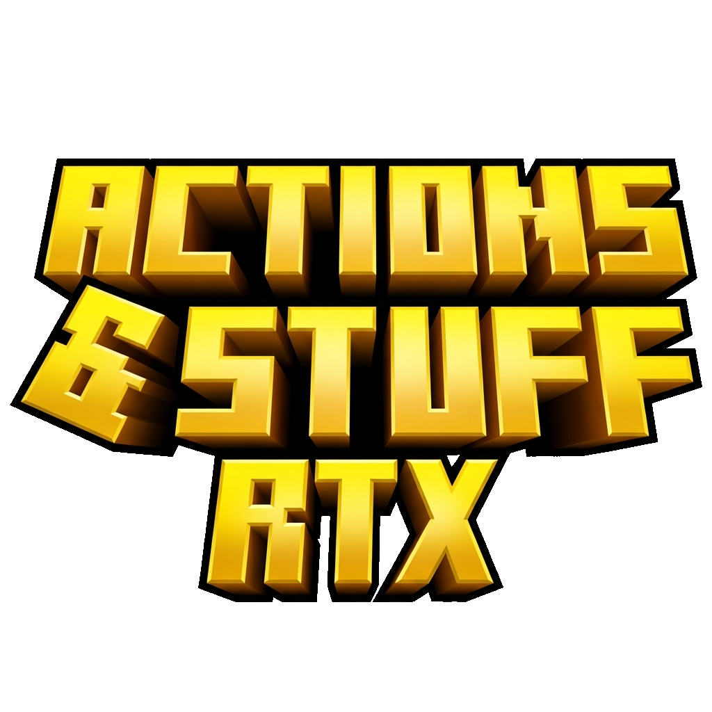

<table>
<tr>
<td width="180" align="center">

</td>
<td>

## 📖 A&S RTX Patcher — Tutorial & Reference

*Complete guide to every feature of the patcher*

[](../README.md)
[](https://github.com/Felix-Chaos/Actions-and-Stuff-RTX-Patcher/releases/latest)
[](https://discord.gg/YrMMmN2kc7)

</td>
</tr>
</table>

---

## ⚙️ Requirements

| | Requirement | Details |
| :---: | :--- | :--- |
| 🎮 | [**BetterRTX**](https://bedrock.graphics/) | Must be installed before patching |
| 📦 | [**Actions & Stuff**](https://www.minecraft.net/en-us/marketplace/pdp/oreville-studios/actions--stuff-1.6/61c7a786-d7ad-49e0-a710-817121cd9795) | Marketplace, `.zip`, or `.mcpack` format |

---

## 🚀 Main Menu

When you launch the patcher, you'll see two cards:

### Patching

| Button | Description |
| :--- | :--- |
| ⚡ **Patch from Marketplace** | Auto-detects your installed A&S Marketplace copy and patches it for RTX |
| 📦 **Patch from Local File** | Select a `.zip` or `.mcpack` manually *(Advanced Mode only)* |

### Maintenance

| Button | Description |
| :--- | :--- |
| 🧹 **Clean Old Versions** | Scans for and removes previously patched packs to free space |
| 🎮 **Adjust Settings for RTX** | Applies recommended video settings for RTX (disables mob dithering, etc.) |
| ⚙️ **Adjust All Settings** | Full settings editor *(Advanced Mode only)* |

> The **Advanced Mode** switch in the bottom-right corner reveals hidden options: _Patch from Local File_ and _Adjust All Settings_.

---

## 🔄 Patching Screen

After selecting a patching mode, you'll see the patching screen:

| Element | Description |
| :--- | :--- |
| **Start** | Begins the patching process |
| **Back** | Returns to the main menu (warns you if patching is in progress) |
| **Open Folder** | Opens the output folder containing the generated `.mcpack` *(appears after patching)* |
| ☑️ **Clean old versions before patching** | Automatically removes previous patches before creating a new one |
| **Process Log** | Live output of the patching process *(Advanced Mode only)* |
| 📋 **Copy Log** | Copies the process log to clipboard *(Advanced Mode only)* |

### Advanced Mode Controls

**Advanced Mode** adds these extra controls to the patching screen:

| Control | Description |
| :--- | :--- |
| **Patch Method** | Choose between `Zip (Manual)` or `Custom` mode |
| **Target Version** | Select a specific patch version from the dropdown instead of latest |
| **Source (Folder/Zip)** | Override the source pack path *(Custom mode only)* |
| **Output Filename** | Set a custom `.mcpack` output filename *(Custom mode only)* |
| **Patch File (.vcdiff)** | Use a specific `.vcdiff` patch file *(Custom mode only)* |

---

## 📋 Menu Bar

| Menu | Options |
| :--- | :--- |
| **Creator Tools** | Run bundled scripts for patch development |
| **Dependencies** | Manage and install required dependencies |
| **Help** | Links to documentation and support |

---

## 🎮 After Patching — In-Game Setup

> [!IMPORTANT]
> Disable **"Mob Dithering"** in Video Settings to avoid visual glitches, or use the **Adjust Settings for RTX** button in the patcher.

Set your **Resource Pack load order** (Top → Bottom):

| # | Pack | |
| :---: | :--- | :--- |
| 1 | **A&S for RTX** | ✅ Always on top |
| 2 | **RTX Pack** | Kelly's / Vanilla RTX / etc. |
| 3 | *Other Resource Packs* | Optional |
| 4 | *Actions & Stuff (Original)* | ⚠️ Optional — not recommended |

---

## 🧰 Building from Source

**Prerequisites:** Python 3.10+, `pip`

**1.** Clone and navigate to the patcher directory:

```bash
git clone https://github.com/Felix-Chaos/Actions-and-Stuff-RTX-Patcher.git
cd "Actions-and-Stuff-RTX-Patcher/Actions_and_Stuff_RTX_Patcher"
```

**2.** Run the build script:

```bash
build.bat
```

The build manager will check for missing dependencies (`PyInstaller`, `Pillow`, `ttkbootstrap`) and offer to install them automatically.

**3.** Choose from the build menu:

| Option | Description |
| :--- | :--- |
| **Build — Release** | Builds a windowed `.exe` (no console) |
| **Build — Debug** | Builds with console output for debugging |
| **Version Editor** | Update version numbers across the project |
| **Clean Artifacts** | Remove `build/`, `dist/`, and `.spec` files |

The output executable will be in `dist/AnS_RTX_Patcher_V2.exe`.

> You can also run the patcher directly without building: `python main.py`

---

<div align="center">

[](../README.md)

</div>
